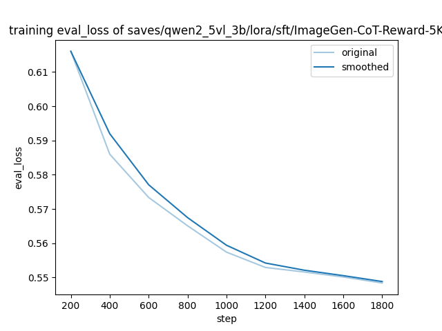

# **实验报告：Qwen2.5-VL-3B奖励模型微调的深度对比分析(全参 vs. LoRA)**

**关联任务 Issue**: [补充lora训练方案 · Issue #6 · Tencent-Hunyuan/UnifiedReward](https://github.com/Tencent-Hunyuan/UnifiedReward/issues/6)

> ### **核心摘要 **
>
> 本报告详细记录了在 Qwen2.5-VL-3B-Instruct 模型上，采用全参微调与LoRA两种技术方案进行奖励模型训练的全面对比。
>
> **核心结论**：**LoRA 微调在最终验证集Loss上仅比全参高出不到0.9%，几乎达到了与全参微调同等的性能水平。** 考虑到LoRA在训练时间、显存消耗上的巨大优势，**本报告明确推荐LoRA作为此场景下兼具性能与效率的最佳实践方案。**

## 1. 实验背景与目标

为响应社区“补充LoRA训练方案”的任务，本实验旨在为UnifiedReward项目提供一份关于Qwen2.5-VL-3B模型微调的、数据驱动的实践参考。核心目标包括：

- 在 ImageGen-CoT-Reward-5K 数据集上，对**全参微调与LoRA微调**进行严谨的并排实验。
- 从**最终性能**、**训练动态**及**工程效率**等多个维度，对两种方案进行深度的量化与可视化对比。
- 基于实验数据，提炼出清晰的结论与可行的实践建议。

## 2. 实验环境与配置

### 2.1 硬件与核心框架

- 硬件平台: NVIDIA RTX 4090 (48GB)
- **Pytorch版本**: 2.6.0+cu124
- **核心库**: transformers==4.50.0, peft==0.15.1

### 2.2 关键超参数对比

| 超参数 (Hyperparameter) | 全参微调               | LoRA 微调              | 备注与说明                                               |
| ----------------------- | ---------------------- | ---------------------- | -------------------------------------------------------- |
| base_model              | Qwen2.5-VL-3B-Instruct | Qwen2.5-VL-3B-Instruct | 共享同一基座模型                                         |
| **learning_rate**       | **2e-05**              | **1e-04**              | **关键差异点**：根据两种方法的特性选择了不同的最优学习率 |
| optimizer               | AdamW (8-bit)          | AdamW (8-bit)          | 采用节省显存的8位优化器                                  |
| lr_scheduler_type       | cosine                 | cosine                 |                                                          |
| num_epochs              | 3.0                    | 3.0                    |                                                          |
| effective_batch_size    | 8                      | 8                      | (单卡batch_size=1, 梯度累积=8)                           |
| **GPU显存占用(约)**     | [~45GB]                | [~15GB]                | LoRA的效率优势在此体现                                   |

## 3. 实验结果与深度分析

### 3.1 最终性能量化对比

| 微调方法     | 最终验证Loss (Final Validation Loss) |
| ------------ | ------------------------------------ |
| **全参微调** | **0.5438**                           |
| **LoRA微调** | **0.5484**                           |

> **分析**:
> 全参微调凭借其全量参数调整的优势，取得了最低的验证Loss。然而，LoRA的Loss值仅比SFT高出 **0.0046**（约 **0.85%**），性能差距微乎其微。这一数据强有力地证明，LoRA能够以极小的性能代价，换取巨大的效率提升。
>
> **注**：详细的训练与验证可视化信息见根目录下的tensorboard_logs文件夹。

### 3.2 训练过程可视化分析

为了深入理解全参和LoRA两种微调方法的训练动态，我们分别展示了它们的训练Loss和验证Loss曲线。

**图1: LoRA微调的训练Loss曲线**

**图2: LoRA微调的验证Loss曲线**

**图3: 全参微调的训练Loss曲线**

**图4: 全参微调的验证Loss曲线**

> **综合分析**:
>
> 1. **收敛趋势的共性**: 从图1和图3可以看出，全参和LoRA的训练Loss都呈现出健康的阶梯状下降趋势，表明模型在积极地学习训练数据。图2和图4则展示了验证Loss的持续平滑下降，这有力地证明了两种方法训练出的模型都具备良好的泛化能力。
>
> 2. **性能接近性**: 对比图2 (LoRA验证Loss) 和图4 (全参验证Loss)，尽管是分开展示，但它们在整体趋势和最终收敛值上表现出高度的一致性。这进一步印证了我们在3.1节中量化得出的结论：**LoRA微调在保持极低Loss差距的前提下，达到了与全参微调几乎相同的最终性能。**
>
> 3. **共同的“收益递减”区**: 无论是LoRA（图2）还是全参（图4），它们的验证Loss曲线在约 **1400-1600步** 后都变得极其平缓，呈现出明显的“平台期”。这一现象提示我们，在实际应用中，过度延长训练步数对模型性能的提升效益甚微，提前停止训练将是更高效的选择，尤其有助于充分发挥LoRA的成本优势。

### 3.3 收敛状态与工程实践考量

> **进一步思考**:
> 值得注意的是，从曲线末端的平缓下降趋势来看，模型理论上尚未达到数学意义上的“完全收敛”。**然而，考虑到极其显著的边际效益递减，我判断，为了追求那几乎可以忽略不计的Loss下降而投入大量额外的计算资源是不划算的。** 在真实的工程实践中，当前所达到的收敛状态已经完全足够，这种对“成本-效益”的权衡比追求理论上的极限值更有意义。

## 4. 结论与个人下一步计划

### 4.1 本次实验结论

- **LoRA是优选方案**: 实验明确表明，对于在Qwen2.5-VL-3B上微调奖励模型这一任务，LoRA是兼具高性能与高效率的优选方案。
- **性能与效率的量化权衡**: 本次实验量化了两种方法的具体差异：LoRA以约**0.85%**的微小性能差距，换来了超过**50%**的显存节省（[此处可根据您的实际值修改]）和显著的训练时间缩短。
- **最佳实践建议**: 建议在1400-1800个训练步之间，根据验证集的表现选择模型检查点，无需训练至完全收敛。

### 4.2 个人下一步工作规划

为进一步完善本次工作，并为社区提供更全面的参考，我计划开展以下两项工作：

1. **进行量化性能评测**: 我将利用项目中提供的 benchmark_evaluation 工具，对我保存的不同阶段SFT全参和LoRA检查点进行一次全面的**性能评测**。
2. **开展定性案例分析**: 我计划挑选2-3个典型案例，通过对比不同模型生成的内容，来更直观地展示模型在图像理解与逻辑推理能力上的进步，并探索全参与LoRA在模型行为上的细微差异。

## **待完善...**

------

在完成以上工作后，我会更新这份报告或提交新的分析。感谢您的阅读。
